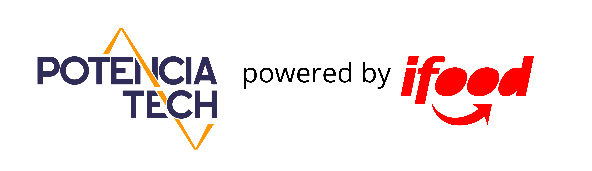

  

<h1>Repositório usado para o <strong>Bootcamp Potência Tech iFood</strong> - Desenvolvimento de Jogos na plataforma DIO.</h1>

<strong>HTML</strong> - exercícios da parte de aprendizado em HTML

<strong>CSS</strong> - exercícios da parte de aprendizado em CSS

O reset.css que está nesse repositório é o reset.css que eu usei para os projetos. Só tá aí para eu ter fácil acesso.

  

